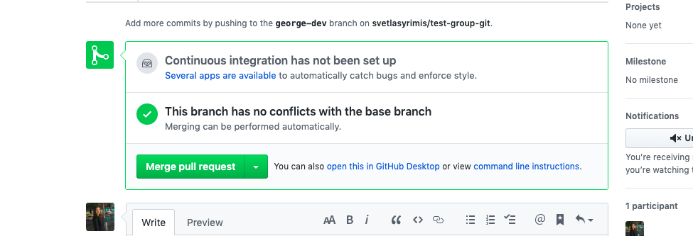
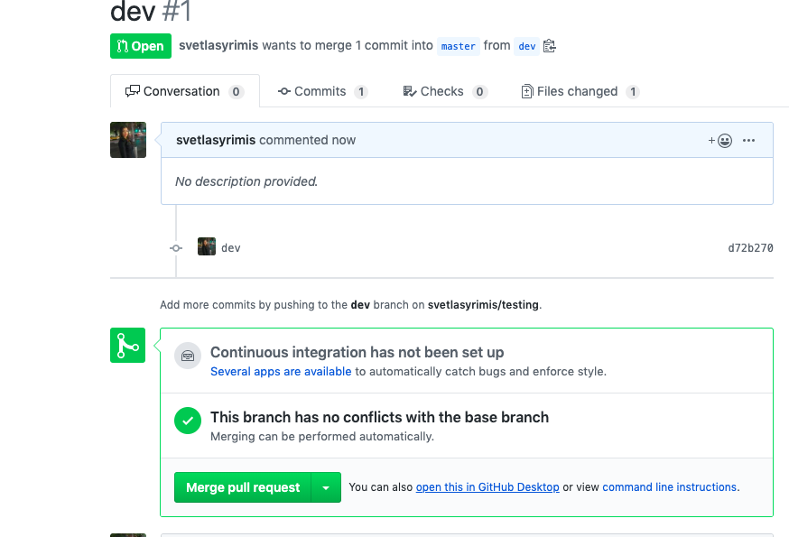

### Git Group exercise

# Group Git

## [Git Docs](https://www.git-scm.com/docs)

Once settled in your groups decide who will be the Git Czar
*********
### Git Czar does:

1. On GitHub(personal GitHub **NOT** Enterprise) make a project repo called `git-group-practice`. Make it public and initialize a README).

2. Share the git repo link with your team in slack.

3. In Settings, under Collaborators, add your team members.

4. Your team members should have received an invitation to collaborate via email.

5. **Clone** the repo to your local machine. It's your own repo so **Do not fork.** `cd` into the `git-group-practice` directory.
 
 * Switch to a new branch `dev`.

```
➜  git-group-practice:(master) git checkout -b dev
Switched to a new branch 'dev'
```

 * Make a change to the README.md file, add, commit and push to the remote `dev`
 
```
➜  git-group-practice git:(dev) git add .
➜  git-group-practice git:(dev) ✗ git commit -m "dev"
[dev d72b270] dev
 1 file changed, 3 insertions(+), 1 deletion(-)
➜  git-group-practice git:(dev) git push origin dev 
Enumerating objects: 5, done.
Counting objects: 100% (5/5), done.
Writing objects: 100% (3/3), 271 bytes | 135.00 KiB/s, done.
Total 3 (delta 0), reused 0 (delta 0)
remote: 
remote: Create a pull request for 'dev' on GitHub by visiting
remote:      https://github.com/svetlasyrimis/testing/pull/new/dev
remote: 
To https://github.com/svetlasyrimis/testing.git
 * [new branch]      dev -> dev
➜  testing git:(dev)
```
If you go to Github, you should see the following: 


Now that you have a remote `dev` branch let's go ahead and set it as the **default** branch of our repository.


**The default branch is considered the base branch in your repository, against which all pull requests and code commits are automatically made, unless you specify a different branch.**

[Setting the default branch](https://help.github.com/en/github/administering-a-repository/setting-the-default-branch)

Your default branch is named `master`. However, we suggest using a `dev` branch instead of `master`. If you have admin rights over a repository on GitHub, you can change the default branch on the repository.


6. In Settings, in the left menu, click Branches.

Update the `dev` to be the default branch.


### The rest of the members:

1. **Clone** the repo to your local machine. **Do not fork.** `cd` into the `git-group-practice` directory.

1. Type `git branch -a` to see which branch you are on, as well as, your remotes. The branch you are on is supposed to have a `*` in front.

```
* dev
  master
```

1. Create a branch as yourname-dev `git checkout -b yourname-dev`. 
    > (i.e., git checkout -b svetla-dev)

1. Open the `README` in the text editor.

1. Navigate to [Facts Site](https://www.thefactsite.com/) and select a fun and interesting fact of your choice. Copy and paste the text into the `README` file. You can do this task at the same time.


1. Check to see which changes were made using `git status`. 


**It should look something like this:**

```
On branch svetla-dev
Changes not staged for commit:
  (use "git add <file>..." to update what will be committed)
  (use "git checkout -- <file>..." to discard changes in working directory)

	modified:   README.md

no changes added to commit (use "git add" and/or "git commit -a")
```

7. `git add README.md` for staging and then `git commit -m "add readme"`.

8. All members should push their changes.

  `git push origin svetla-dev`

### All members do:
- On Github, under the Your Branches section, make a pull request using the new pull request button, base should be set to head and compare will be the yourname -dev. 

*OR*

- In the pull request tab, select New Pull Request, and then select base to be master and compare will be the yourname-dev branch. Once confirmed click on Create Pull Request.


### Git Czar does:
1. On Github, click on the Pull Requests tab. You should see pull requests from all team members.

2. Choose one, got to Files Changed, review the changes, then go to Conversation  and merge it in.

3. Select the next pull request and notice there is most likely a merge conflict. 

4. Request the team member to resolve the merge conflict.

5. Once the merge conflict is resolved, merge it in.

### Team member with a merge conflict

1. Make sure you are on yourname-dev

`git checkout yourname-dev`

2. Get the **latest changes** from `dev` by running `git pull origin dev` (very important step).

3. The text editor will highlight the merge conflict like so:

```
# git-group-practice
<<<<<<< HEAD
*YOUR VERSION*
=======
*What's currently on dev branch*
>>>>>>> commit hash
```
4. The objective is to have both your changes, so in this situation simply remove `<<<<<<< HEAD`, `=======` and `>>>>>>> commit hash`

5. The editor may have the following option as well:


   You may choose to `Accept Both Changes`.

6. Add, commit and push your changes. 

7. Go back to GitHub, on Pull Request tab, select your Pull Request again and this time you should see: 



8. Inform the Git Tzar that your code is ready to be merged.


You can continue and merge `dev` branch into `master` or you can skip ahead next two bullet points.

 * Next, click on `Compare & pull request` on the `dev` branch you just pushed.

 * After creating your pull request, you should see:




### Everyone does:
1. `git checkout master` —— switch to the master branch
1. `git pull origin master` ——— get the changes from the master 
1. `git checkout yourname-branch` ———— to switch your branch
1. `git merge master` ———- to merge master changes into your branch

- Now everyone should see the updated file in their text editor. 

- Confirm your changes are the same as on github enterprise.

1. Switch to master branch, `git checkout master`
1. Delete your remaining branches `git branch -d yourname-branch` [-d or -D ?](https://koukia.ca/delete-a-local-and-a-remote-git-branch-61df0b10d323)

`git log --oneline --decorate --graph --all` to see the history of what we just did. 

